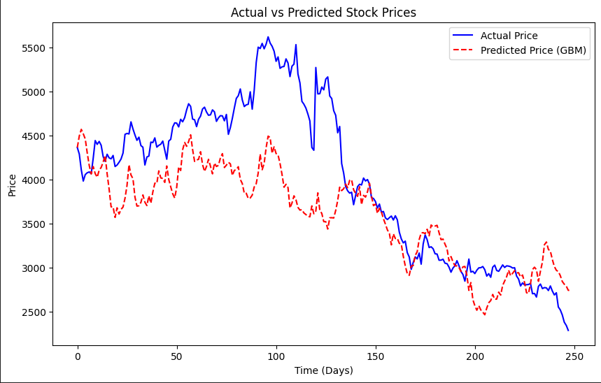
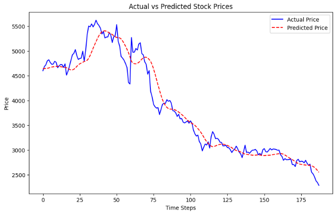
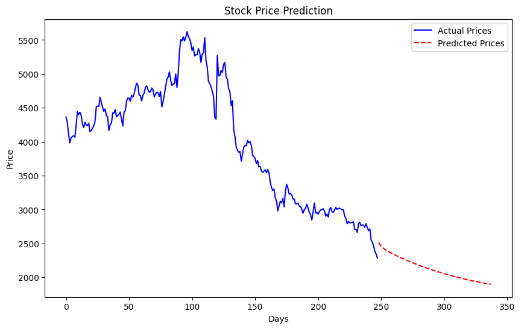

# Stock Price Prediction using Optimal Stopping Theory

Code and Report for ASP Project 

Group Members:
- Pranav Saxena (2022AAPS0257G)
- Shrirang Bhale (2023B4A30935G)

## Prediction using Optimal Stopping Theory

Our main code which utilizes Optimal Stopping Theory can be found [here](Stock_Price_Prediction_OST.ipynb)

Results :- 



We get a decent result from our simulated GBM compared to actual historical data.

Backtesting Results :-
```
Initial Balance : 10000
Mean Final Balance: 9312.50
Mean Return on Investment (ROI): -6.87%
```
The predicted value of mean ROI seems to be accurate as the trend of HAL stock is negative recently and would ultimately result in loss, hence a negative ROI.

We also tested the calculation of probability of reaching a target price within a specific time using P[Ta<t] = 2P(z > |a|/sqrt(t))
```
Current Price : 2287.0
Probability of reaching price 2500 in 36.00 days: 0.2133
```
The probability seems to be accurate since the current trend of stock is negative and it resulting in a better return after 36 days has a lower probability of 0.2133

## Extension to LSTM

We extend our method to using LSTM for comparison. 



We can see that the predicted values using LSTM are more accurate compared to simulations using Geometric Brownian Motion.

We can then predict future values of stock using our trained LSTM model and make our decisions related to trading stocks accordingly



## Conclusion

Using Purely SBM and Optimal Stopping Theory, we can get good results and can be used to make our trading decisions accordingly.

For more accuracy, we can utilize LSTM and train it on NSE stock data but this goes beyond the scope of the course.

Our experiments were performed on the historical data of NSE Stocks BAJAJ FINSERV and HAL
